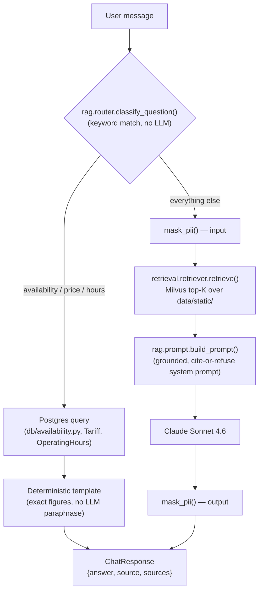

# Parking Reservation Chatbot

[](https://github.com/VladKovalskiy/parking-reservation-chatbot/actions/workflows/ci.yml)

A RAG chatbot for parking-space information and reservation, with a
human-in-the-loop confirmation step before any booking is made. University
course project, delivered in 4 stages.

| Stage | Content | Status |
|-------|---------|--------|
| 0 | Environment, CI, project skeleton | ✅ |
| 1 | RAG pipeline, vector store, static/dynamic split, guardrails, evaluation | ✅ |
| 2 | — | ⬜ |
| 3 | — | ⬜ |
| 4 | — | ⬜ |

Each stage is submitted as a git tag `stage-N` (`stage-0`, `stage-1`, …),
tagging the exact commit graded for that stage. The course submission form
gets a link to that tag, e.g.:

```
https://github.com/VladKovalskiy/parking-reservation-chatbot/tree/stage-1
```

Tag a stage once it's done and pushed:

```bash
git tag stage-1
git push origin stage-1
```

## Architecture



A question is classified once, with **no LLM call**, into one of two paths:

- **Dynamic (SQL)** — availability, prices, and operating hours change on
  their own schedule and live in Postgres, never in the vector store (see
  [Dynamic data](#dynamic-data-postgresql) below). The answer is a
  deterministic string built from the query result — never an LLM
  paraphrase of a price or a closing time, so the number in the answer is
  always exactly the number in the database.
- **Static (RAG)** — everything else (general info, location, booking
  process, rules) is answered by retrieving the top-K chunks from Milvus and
  generating a grounded answer with Claude Sonnet 4.6, refusing to answer
  from outside the retrieved context (`rag/chain.py`, `rag/prompt.py`).

PII guardrails (Microsoft Presidio) wrap only the RAG leg — masking the
*classified* question before it reaches the prompt, and the generated
answer before it reaches the user. Classification itself runs on the raw
question and is never masked: it's a local keyword match with no network
call, and masking first actively breaks it (see
[`rag/router.py`](src/parking_bot/rag/router.py)'s docstring and
[Known traps](CLAUDE.md#known-traps) for the live bug this fixed). A SQL
answer is never masked either — it's our own template over known-safe DB
columns, not user-typed free text.

Reservation intake (collecting a user's name, license plate, and requested
time period, with validation and clarifying follow-up questions) is a
separate, already-implemented flow — see
[Reservation intake](#reservation-intake) below — not yet wired into the
`/chat` endpoint above; that wiring is stateful multi-turn dialogue, which
belongs to `graph/` in stage 2.

## Stack and why

| Component | Choice | Rationale |
|-----------|--------|-----------|
| LLM | Anthropic Claude | Haiku for cheap internal steps (routing, extraction, guardrails), Sonnet for generation |
| Embeddings | `sentence-transformers` (multilingual-e5) | Anthropic has no embeddings API; a local model runs offline, is free, and lets the evaluation compare models |
| Vector store | Milvus (Lite in dev/CI, standalone in demo) | one `langchain-milvus` library for both modes — local dev needs no Docker, the demo gets a full server |
| Dynamic data | PostgreSQL | availability, hours, and prices change on their own schedule — not a job for vector search (see [`docs/sql-schema.md`](docs/sql-schema.md)) |
| Guardrails | Presidio | pre-trained NLP models for PII detection |
| Orchestration | LangGraph | needed for stateful dialogue and human-in-the-loop confirmation in later stages |

## Setup

Prerequisites:

- [`uv`](https://docs.astral.sh/uv/) — installs and manages Python for you:
  ```bash
  curl -LsSf https://astral.sh/uv/install.sh | sh
  ```
  (`uv` will install Python 3.12 itself on first use — no separate Python setup needed.)
- Docker + Docker Compose — **optional**, only needed for the standalone
  Milvus demo mode. Local development and tests use Milvus Lite (a local
  file) and don't need Docker at all.
- If you're on Windows, work inside WSL2 and keep the repo on the Linux
  filesystem (e.g. `~/dev/parking-bot`), **not** under `/mnt/c` — I/O on a
  mounted Windows drive is slow and breaks file watchers.

Steps:

```bash
# 1. Install dependencies (downloads Python 3.12 automatically if needed)
make install

# 2. Configure environment
cp .env.example .env
# then edit .env and set ANTHROPIC_API_KEY to a real key
# (not required for unit tests, only for the LLM smoke test and the chatbot itself)

# 3. Install pre-commit hooks
make hooks

# 4. Verify the setup
make test
```

If `make test` passes, the setup is complete — unit tests need no API key
and no running services (see [Testing](#testing)).

### Optional: Milvus standalone + PostgreSQL (demo mode)

```bash
make up      # starts Milvus standalone, Postgres, and Attu (UI) on http://localhost:8000
```

Then switch `.env` from Milvus Lite to standalone by setting:

```
MILVUS_URI=http://localhost:19530
```

(Leave `MILVUS_LITE_PATH` as-is — it's only used when `MILVUS_URI` is unset.
See [Known traps](CLAUDE.md#known-traps) in `CLAUDE.md` for why these are two
separate variables.) Stop the stack with `make down`.

## Try it yourself

A step-by-step path from a finished [Setup](#setup) to actually chatting
with the bot over HTTP — both the SQL side (prices/hours/availability,
answered straight from Postgres) and the RAG side (everything else,
answered from the vector store via Claude Sonnet 4.6).

```bash
# 1. Start Postgres (+ Milvus standalone + Attu, same compose file)
make up

# 2. Create the Postgres schema and load demo data: spaces, tariffs,
#    operating hours, one seed reservation
make db-init
make db-seed

# 3. Index data/static/ into Milvus (Lite by default, no extra setup —
#    switch to standalone per "Optional" above if you want to browse the
#    collection in Attu instead of just querying it)
uv run python -m parking_bot.ingestion.pipeline

# 4. Start the API. NOTE: Attu already holds port 8000 (see step 1), so
#    the API needs a different one.
uv run uvicorn parking_bot.api.app:app --reload --port 8080
```

With that running, ask it a dynamic question (Postgres, no LLM call) and a
static one (retrieval + Claude Sonnet 4.6) — real output from this exact
walkthrough:

```bash
curl -X POST http://127.0.0.1:8080/chat \
  -H 'Content-Type: application/json' \
  -d '{"message": "How much does parking cost?", "session_id": "demo"}'
```
```json
{
  "answer": "Current prices:\nBicycle (weekday): 0.00 USD/hour\nCar (weekday): 5.00 USD/hour\nCar (weekend): 3.00 USD/hour\nMotorcycle (weekday): 2.50 USD/hour",
  "source": "sql",
  "sources": ["postgres"]
}
```

```bash
curl -X POST http://127.0.0.1:8080/chat \
  -H 'Content-Type: application/json' \
  -d '{"message": "How do I make a reservation?", "session_id": "demo"}'
```
```json
{
  "answer": "To reserve a parking spot, tell me your desired date, arrival time, and expected duration. I'll check availability and propose a matching time slot — no spot is booked automatically, you confirm it first. (source: booking.md#how-to-reserve)",
  "source": "rag",
  "sources": ["booking.md#how-to-reserve", "..."]
}
```

Prefer clicking over `curl`? Open <http://127.0.0.1:8080/docs> for FastAPI's
interactive Swagger UI — expand `POST /chat`, "Try it out", fill in
`message`/`session_id`, "Execute". <http://localhost:8000> (Attu) lets you
browse the Milvus collection the same way, if you switched to standalone.

Other things worth trying once this is running:

- [Reservation intake](#reservation-intake) below — a separate,
  already-working flow (not yet wired into `/chat`, see
  [Architecture](#architecture)) for collecting a booking's name, plate, and
  time period. `uv run python scripts/play_booking.py` is a REPL for it.
- `make db-seed` again any time to reset the demo Postgres data back to a
  known state.

Done for now? `make down` stops everything from step 1.

## Usage

`graph/` (stateful, multi-turn dialogue) is scaffolding for stage 2+, but a
working chat interface already exists for stage 1's info/SQL-vs-RAG flow —
see [Try it yourself](#try-it-yourself) above to run it end to end. The
short version: `uv run uvicorn parking_bot.api.app:app --reload` (pick a
port that isn't held by Attu if `make up` is running), `POST /chat` with
`{"message": ..., "session_id": ...}`.

Every request goes through `rag.router.answer_dynamic_question()`: classify
the *raw* question (SQL vs. RAG), then for the RAG branch only, mask PII in
the question before building the prompt and mask PII in the answer after
generation (`guardrails.pii.mask_pii()`). Classifying before masking is
deliberate, not an oversight — see the function's docstring and
CLAUDE.md's Known traps for the live bug that taught us why. Needs Postgres
running (`make up`; `/chat` opens a session per request via
`api/dependencies.py`'s `get_db_session`) and `ANTHROPIC_API_KEY` set for
questions that fall through to RAG.

What else you can run:

- **Manual smoke checks** (`scripts/smoke_*.py`) — manual inspection
  scripts, not pytest tests, so they never run in CI. Most hit live services
  (cost tokens, download a model); `smoke_chunker.py` is the exception and
  runs fully offline:
  ```bash
  # Verifies ANTHROPIC_API_KEY reaches both configured models
  uv run python scripts/smoke_anthropic.py

  # Loads the embedding model, indexes 3 documents into Milvus, checks retrieval
  uv run python scripts/smoke_embeddings.py

  # Ingests data/static/, asks a grounded question and an out-of-scope one
  uv run python scripts/smoke_rag_chain.py

  # Offline: prints how data/static/*.md gets loaded and chunked
  uv run python scripts/smoke_chunker.py
  ```
  `smoke_embeddings.py` downloads the `intfloat/multilingual-e5-base` model
  (~1 GB) on first run, and connects to whichever Milvus target is
  configured in `.env` — Lite by default, or standalone if `MILVUS_URI` is
  set — with no code changes needed to switch between them.
- **Unit tests** — see [Testing](#testing) below.

## Reservation intake

The other half of stage 1's "interactive features" requirement — collecting
a reservation, not just answering questions — is
[`booking/collector.py`](src/parking_bot/booking/collector.py). It isn't
wired into the `/chat` endpoint yet (that needs stateful multi-turn dialogue
— tracking which field was last asked for across HTTP requests — which is
what `graph/` is for in stage 2); today it's a tested, standalone
Python API:

```python
from parking_bot.booking.collector import BookingFields, collect_booking_turn
from parking_bot.db.base import build_engine, build_session_factory

session = build_session_factory(build_engine())()
fields = BookingFields()

result = collect_booking_turn(session, "chat-session-1", fields, {"first_name": "John"})
print(result.question)  # "What's your last name?" — next field, no LLM involved

result = collect_booking_turn(
    session,
    "chat-session-1",
    result.fields,
    {
        "last_name": "Smith",
        "license_plate": "AB12 CDE",
        "starts_at": "2027-03-01T09:00+00:00",
        "ends_at": "2027-03-01T12:00+00:00",
    },  # any future date
)
print(result.is_complete)  # True — a Reservation(status="draft") is now in Postgres
```

Each call merges new field values into the running `BookingFields`,
validates them (name format, license-plate pattern, and the period against
`rules.md#time-limits`'s 1-hour-to-14-day window — no LLM, same reasoning as
the router's keyword classification: this is a narrow, rule-shaped problem
a model call would only make slower and less predictable), and either asks
for the next missing/invalid field or persists a `status='draft'` row (see
[Dynamic data](#dynamic-data-postgresql)) once everything checks out. No
space or tariff is matched yet at that point — that's a further step, not
yet implemented, that would move the row to `pending_confirmation`.

## Structure

```
src/parking_bot/
├── config.py       # typed config; every provider swappable via env
├── ingestion/      # document loading and chunking
├── retrieval/      # vector store, retriever
├── llm/            # chat + embeddings factories, plus fake backends for tests
├── rag/            # grounded RAG chain + static/dynamic SQL-vs-RAG router
├── guardrails/     # PII filtering
├── eval/           # Recall@K / Precision@K harness (make eval)
├── db/             # SQLAlchemy models + init/seed for dynamic data (docs/sql-schema.md)
├── booking/        # interactive booking-field intake: validate, ask, persist a draft
├── graph/          # LangGraph state (stage 2+)
└── api/            # FastAPI chat interface: routing -> RAG/SQL (guardrails around the RAG leg) -> response
data/
├── static/         # documents for the vector store: general info, location,
│                   # booking process, rules — see the static/dynamic split
│                   # in docs/sql-schema.md
└── eval/           # golden_set.jsonl — question → relevant-document pairs
docs/
├── sql-schema.md   # PostgreSQL schema design for dynamic data
└── evaluation.md   # Recall@K/Precision@K/latency report, embedding model comparison
scripts/            # manual smoke checks (not run in CI)
tests/              # pytest unit tests (offline, no live services)
```

## Testing

Unit tests need neither API keys nor running services: `tests/conftest.py`
forces `EMBEDDING_PROVIDER=fake` and an in-memory-style Milvus Lite store
(`MILVUS_LITE_PATH=:memory:`). Tests that require a real Milvus/Postgres or
API access are marked `integration` and excluded from CI.

```bash
make test       # unit tests only (excludes the integration marker) — what CI runs
make test-all   # everything, including integration tests
make lint       # ruff check + format --check
make fmt        # ruff format + check --fix — run before committing
```

`mypy` also runs in CI (`uv run mypy src`) but is currently non-blocking.

## Evaluation

`data/eval/golden_set.jsonl` holds 28 hand-labeled question → relevant-document
pairs against `data/static/`, written before any retrieval code so the set
isn't fitted to what the system already does.

```bash
make eval
```

Re-ingests `data/static/` (using whichever embedding provider/model is
configured in `.env`), runs every golden-set question through retrieval, and
computes Recall@K and Precision@K at several cutoffs (default `k=1,3,5,10`).
Writes `data/eval/report.json`, e.g.:

```json
{
  "num_questions": 28,
  "metrics": {
    "1": {"recall_at_k": 0.84, "precision_at_k": 0.86},
    "5": {"recall_at_k": 0.96, "precision_at_k": 0.20}
  },
  "embedding_provider": "local",
  "embedding_model": "intfloat/multilingual-e5-base"
}
```

Because embeddings/vector-store choice comes entirely from config (ADR-001/
002/003), re-running the report against a different embedding model is a
`.env` change, not a code change — this is what makes model comparison cheap.
Pass `--k`, `--golden-set`, `--report`, or `--skip-ingest` to
`uv run python -m parking_bot.eval.harness` to override the defaults.

See [`docs/evaluation.md`](docs/evaluation.md) for the full report: methodology,
Recall@K/Precision@K and latency tables, and a `multilingual-e5-base` vs.
`multilingual-e5-small` comparison that justifies ADR-001's choice of local,
swappable embeddings.

## Dynamic data (PostgreSQL)

Spaces, tariffs, operating hours, and reservations are not a RAG problem
(see [Stack](#stack-and-why)). The schema design, the static/dynamic
boundary, and the reasoning behind key decisions (double-booking guard,
price snapshotting, availability as a query rather than a table) are in
[`docs/sql-schema.md`](docs/sql-schema.md).

```bash
make up        # starts Postgres (+ Milvus standalone + Attu)
make db-init   # creates the schema — src/parking_bot/db/init_db.py
make db-seed   # init + loads demo spaces/tariffs/hours/a reservation
```

SQLAlchemy models live in [`src/parking_bot/db/models.py`](src/parking_bot/db/models.py),
one per `docs/sql-schema.md` table. There is deliberately no `Availability`
model — [`db/availability.py`](src/parking_bot/db/availability.py) answers
"which spaces are free in this window" as a query instead, matching the
design doc's reasoning. The `reservations` double-booking guard
(`EXCLUDE USING gist`) is PostgreSQL-only and can't be expressed as a
portable SQLAlchemy constraint, so it's attached via a dialect-scoped DDL
event — real on Postgres, silently absent on the SQLite used by
`tests/test_db.py`'s offline CRUD tests. That one guard is covered
separately by `tests/test_db_integration.py` (`@pytest.mark.integration`,
needs `make up`).

### Static/dynamic routing

[`rag/router.py`](src/parking_bot/rag/router.py) is what actually enforces
the static/dynamic split at answer time: `classify_question()` routes
availability/price/hours-shaped questions to a SQL query (formatted
directly into the answer — no LLM paraphrase of a price or a closing time,
by design) and routes everything else to the grounded RAG chain. Routing is
deterministic keyword matching, not an LLM call — see the module docstring
for why that's consistent with how `guardrails/pii.py` and
`booking/collector.py` made the same call for their own "cheap internal
step."

## CI

GitHub Actions runs on every push and PR: ruff (lint + format), mypy, and
pytest with coverage. No secrets are required.
