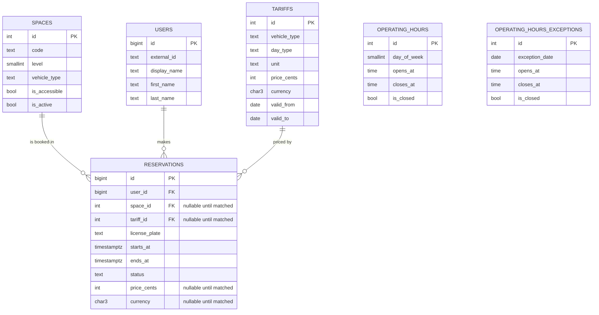

# Dynamic data: PostgreSQL schema (design)

Design-only document for the dynamic side of the data split described in
[CLAUDE.md](../CLAUDE.md): spaces, tariffs, operating hours, and
reservations. No migrations or ORM models exist yet — this is the reference
the stage-1 implementation will be built against.

## Static vs. dynamic boundary

| Goes to Postgres (this doc) | Goes to the vector store (`data/static/`) |
|---|---|
| Space inventory, capacity, per-space status | General info, payment methods, vehicle policy — [general.md](../data/static/general.md) |
| Tariffs / prices (current and historical) | Location and directions — [location.md](../data/static/location.md) |
| Operating hours and exceptions (holidays) | Booking process narrative — [booking.md](../data/static/booking.md) |
| Reservations and their status | Rules and restrictions — [rules.md](../data/static/rules.md) |

The rule of thumb: if the fact **changes on its own schedule** (prices get
revised, a spot gets booked, hours shift for a holiday) it must come from a
live query, not from retrieval — a vector store can go stale silently and a
generated answer has no way to guarantee it repeated an exact number
correctly. This is why the golden set in `data/eval/golden_set.jsonl`
deliberately has no questions about price or hours: those are answered by an
SQL/tool call in the graph, not by RAG, so they don't belong in a retrieval
evaluation set.

## Entity-relationship overview



`OPERATING_HOURS` / `OPERATING_HOURS_EXCEPTIONS` have no FK into
`RESERVATIONS` — they gate *when* a reservation can be created, they don't
belong to one.

## Tables

### `spaces`

One row per physical, individually reservable spot.

```sql
CREATE TABLE spaces (
    id            SERIAL PRIMARY KEY,
    code          TEXT NOT NULL UNIQUE,        -- human-readable label, e.g. "A-12", used in confirmations
    level         SMALLINT NOT NULL,
    vehicle_type  TEXT NOT NULL CHECK (vehicle_type IN ('car', 'motorcycle', 'bicycle')),
    is_accessible BOOLEAN NOT NULL DEFAULT FALSE,
    is_active     BOOLEAN NOT NULL DEFAULT TRUE  -- FALSE = maintenance / decommissioned, never offered
);
```

Mirrors the physical layout described in `general.md` (levels 1–2 for
cars/motorcycles, a bicycle rack, accessible spaces on level 1).

There is **no separate `availability` table**. Availability for a given
time window and vehicle type is derived, not stored — see
[Availability is a query, not a table](#availability-is-a-query-not-a-table)
below. Storing it as a denormalized flag would let it drift out of sync with
`reservations`.

### `tariffs`

```sql
CREATE TABLE tariffs (
    id            SERIAL PRIMARY KEY,
    vehicle_type  TEXT NOT NULL CHECK (vehicle_type IN ('car', 'motorcycle', 'bicycle')),
    day_type      TEXT NOT NULL CHECK (day_type IN ('weekday', 'weekend', 'holiday')),
    unit          TEXT NOT NULL CHECK (unit IN ('hour', 'day')),
    price_cents   INTEGER NOT NULL CHECK (price_cents >= 0),
    currency      CHAR(3) NOT NULL DEFAULT 'USD',
    valid_from    DATE NOT NULL,
    valid_to      DATE,                          -- NULL = currently in effect
    UNIQUE (vehicle_type, day_type, unit, valid_from)
);
```

`valid_from`/`valid_to` keep price history instead of overwriting rows in
place, so a tariff change today doesn't alter the recorded price of a
reservation made last month (see `reservations.price_cents` below).

### `operating_hours` and `operating_hours_exceptions`

```sql
CREATE TABLE operating_hours (
    id           SERIAL PRIMARY KEY,
    day_of_week  SMALLINT NOT NULL CHECK (day_of_week BETWEEN 0 AND 6),  -- 0 = Sunday
    opens_at     TIME,
    closes_at    TIME,
    is_closed    BOOLEAN NOT NULL DEFAULT FALSE,
    UNIQUE (day_of_week)
);

CREATE TABLE operating_hours_exceptions (
    id              SERIAL PRIMARY KEY,
    exception_date  DATE NOT NULL UNIQUE,   -- holidays, one-off closures
    opens_at        TIME,
    closes_at       TIME,
    is_closed       BOOLEAN NOT NULL DEFAULT FALSE,
    note            TEXT
);
```

A lookup for a given date checks `operating_hours_exceptions` first, falling
back to the regular `operating_hours` row for that weekday. Times are
facility-local; the facility operates in a single timezone, so no per-row
timezone column is needed (revisit if the project ever spans multiple
facilities — see [Open questions](#open-questions)).

### `users`

```sql
CREATE TABLE users (
    id            BIGSERIAL PRIMARY KEY,
    external_id   TEXT NOT NULL UNIQUE,   -- chat/session identity from the bot channel
    display_name  TEXT,
    first_name    TEXT,   -- collected by the booking intake flow (booking/collector.py)
    last_name     TEXT,   -- collected by the booking intake flow
    created_at    TIMESTAMPTZ NOT NULL DEFAULT now()
);
```

Included only so `reservations.user_id` has something to reference. Not a
real auth system — `external_id` is whatever identity the chat channel
provides. Full account/auth design is out of scope for this stage.
`first_name`/`last_name` are nullable: most interactions (browsing static
info) never touch them, only the booking flow fills them in.

### `reservations`

```sql
CREATE EXTENSION IF NOT EXISTS btree_gist;

CREATE TABLE reservations (
    id              BIGSERIAL PRIMARY KEY,
    user_id         BIGINT NOT NULL REFERENCES users(id),
    space_id        INTEGER REFERENCES spaces(id),      -- NULL until a space is matched (see 'draft' below)
    tariff_id       INTEGER REFERENCES tariffs(id),      -- which tariff produced the price, for audit
    license_plate   TEXT,                                -- collected by the booking intake flow
    starts_at       TIMESTAMPTZ NOT NULL,
    ends_at         TIMESTAMPTZ NOT NULL CHECK (ends_at > starts_at),
    status          TEXT NOT NULL DEFAULT 'draft'
                    CHECK (status IN ('draft', 'pending_confirmation', 'confirmed', 'cancelled', 'no_show', 'completed')),
    price_cents     INTEGER CHECK (price_cents >= 0),    -- NULL until a tariff is matched; snapshot, not a live join
    currency        CHAR(3),                              -- NULL until a tariff is matched
    created_at      TIMESTAMPTZ NOT NULL DEFAULT now(),
    confirmed_at    TIMESTAMPTZ,
    cancelled_at    TIMESTAMPTZ,

    EXCLUDE USING gist (
        space_id WITH =,
        tstzrange(starts_at, ends_at) WITH &&
    ) WHERE (status IN ('pending_confirmation', 'confirmed'))
);
```

**`status = 'draft'`** is the row created by the interactive booking-intake
flow ([`booking/collector.py`](../src/parking_bot/booking/collector.py)) once
the user's name, license plate, and requested time period are all collected
and validated — before a space or tariff has been matched to the request.
That's why `space_id`/`tariff_id`/`price_cents`/`currency` are nullable: a
draft holds `user_id`, `license_plate`, `starts_at`/`ends_at` only. A draft
is never subject to the double-booking guard below (`space_id IS NULL`, and
`'draft'` isn't in the guard's `WHERE` list), so collecting several drafts
concurrently for the same time window can't collide — the guard only
engages once a specific space is assigned and the row moves to
`pending_confirmation`.

Two decisions worth calling out:

- **`price_cents` is a snapshot**, copied from the matching `tariffs` row at
  booking time, not computed on read. `tariff_id` is kept for audit/debugging
  but the charged price must never change retroactively because the tariff
  table changed later.
- **The `EXCLUDE` constraint is the double-booking guard.** It rejects any
  insert/update whose `[starts_at, ends_at)` range overlaps another row for
  the same `space_id`, but only while that other row is
  `pending_confirmation` or `confirmed` — a `cancelled`/`no_show`/`completed`
  reservation frees the space immediately. This enforces the
  human-in-the-loop flow in `booking.md` at the database level: even the
  `pending_confirmation` row (created before the user says "yes") holds the
  slot, so two concurrent chats can't be offered — and both confirm — the
  same space.

### Availability is a query, not a table

"Is a car space free from 14:00 to 16:00 tomorrow?" is answered by checking
which active `spaces` rows have no overlapping `pending_confirmation`/
`confirmed` reservation in that window:

```sql
SELECT s.*
FROM spaces s
WHERE s.vehicle_type = 'car'
  AND s.is_active
  AND NOT EXISTS (
      SELECT 1 FROM reservations r
      WHERE r.space_id = s.id
        AND r.status IN ('pending_confirmation', 'confirmed')
        AND tstzrange(r.starts_at, r.ends_at) && tstzrange(:window_start, :window_end)
  );
```

## Open questions

Not blocking for this stage, flagged for whoever implements the models:

- **Multi-facility support.** Everything above assumes one physical garage,
  matching the static docs. If a second location is ever added, `spaces`,
  `tariffs`, and `operating_hours` all need a `facility_id`.
- **Grace period / overstay handling.** `rules.md#towing` mentions towing for
  overstaying a reserved window; whether that's a scheduled job flipping
  `status`/flagging the reservation, or handled entirely outside this schema,
  isn't decided yet.
- **Refunds on cancellation.** `booking.md#cancel` mentions a possible
  cancellation fee; no `payments`/`refunds` table exists yet since payment
  processing itself hasn't been designed.
